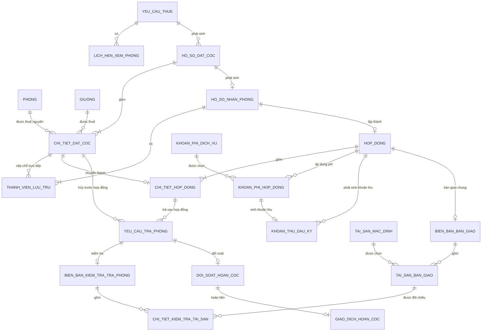

# LƯỢC ĐỒ QUAN HỆ — HỆ THỐNG HOMESTAY DORM

## Phiên bản v7 tối giản  
### Một hồ sơ thuê **một phòng nguyên** hoặc **nhiều giường**

CSC12004 — Nhóm 9

---

# 1. Phạm vi của phiên bản này

Phiên bản này được rút gọn từ lược đồ v4 nhằm đáp ứng đúng yêu cầu hiện tại:

1. Hệ thống chỉ có **một cơ sở hoạt động**, không quản lý chi nhánh.
2. Một yêu cầu thuê, hồ sơ đặt cọc và hợp đồng chỉ sử dụng **một trong hai hình thức**:
   - `NGUYEN_PHONG`: thuê đúng **một phòng nguyên**.
   - `GIUONG`: thuê **một hoặc nhiều giường**.
3. Không cho phép cùng một hồ sơ vừa thuê nguyên phòng vừa thuê giường.
4. Không hỗ trợ thuê nhiều phòng nguyên trong cùng một hồ sơ.
5. Một hồ sơ thuê giường có thể chứa nhiều giường cụ thể. Các giường có thể thuộc cùng phòng hoặc khác phòng.
6. Giữ `HO_SO_NHAN_PHONG` để tách giai đoạn đặt cọc với giai đoạn kiểm tra giấy tờ, thành viên và phê duyệt lưu trú.
7. Bỏ hoàn toàn bảng `PHAN_BO_THANH_VIEN_CHO_O`.
8. Thành viên được gắn trực tiếp với phòng hoặc giường đã đặt thông qua:
   `THANH_VIEN_LUU_TRU.chi_tiet_dat_coc_id`.
9. Có thể ghi nhận tình trạng của từng loại tài sản đã bàn giao khi khách trả phòng/giường thông qua `CHI_TIET_KIEM_TRA_TAI_SAN`.
10. Các khoản phí dịch vụ được cấu hình và áp dụng ở cấp `HOP_DONG`, không gắn riêng vào từng `CHI_TIET_HOP_DONG`.
11. Thiết kế ưu tiên đơn giản, đủ để cài đặt và demo; không nhằm xử lý mọi tình huống nâng cao.

---

# 2. Database này hiện hỗ trợ được những chức năng gì?

## 2.1. Các chức năng được hỗ trợ

| Quy trình trong ngữ cảnh | Mức hỗ trợ | Cách database đáp ứng |
|---|---|---|
| Quản lý nhân viên Sale, Quản lý, Kế toán | Hỗ trợ | `NGUOI_DUNG.vai_tro` |
| Lưu thông tin khách hàng/người đại diện | Hỗ trợ | `KHACH_HANG` |
| Đăng ký thuê nguyên một phòng | Hỗ trợ | `YEU_CAU_THUE.loai_thue = NGUYEN_PHONG` |
| Đăng ký thuê nhiều giường | Hỗ trợ | `YEU_CAU_THUE.so_luong_giuong_du_kien` |
| Lập nhiều lịch xem cho một yêu cầu | Hỗ trợ cơ bản | Tạo nhiều dòng `LICH_HEN_XEM_PHONG` |
| Một hồ sơ đặt cọc thuê một phòng nguyên | Hỗ trợ | Một dòng `CHI_TIET_DAT_COC` chứa `phong_id` |
| Một hồ sơ đặt cọc thuê nhiều giường | Hỗ trợ | Nhiều dòng `CHI_TIET_DAT_COC`, mỗi dòng một `giuong_id` |
| Xác nhận tình trạng từng phòng/giường | Hỗ trợ | Trạng thái và quản lý xác nhận nằm ở `CHI_TIET_DAT_COC` |
| Tính tổng tiền cọc của hồ sơ | Hỗ trợ | Tổng `tien_coc_phan_bo` của các chi tiết |
| Phát hành yêu cầu thanh toán cọc trong 24 giờ | Hỗ trợ | `YEU_CAU_THANH_TOAN_COC.han_thanh_toan` |
| Lưu chứng từ thanh toán | Hỗ trợ | `CHUNG_TU_THANH_TOAN` |
| Ghi nhận hồ sơ nhận phòng | Hỗ trợ | `HO_SO_NHAN_PHONG` |
| Lưu nhiều thành viên lưu trú | Hỗ trợ | `THANH_VIEN_LUU_TRU` |
| Xác định thành viên ở phòng/giường nào | Hỗ trợ | `THANH_VIEN_LUU_TRU.chi_tiet_dat_coc_id` |
| Phê duyệt hoặc từ chối từng thành viên | Hỗ trợ | Các cột kết quả trong `THANH_VIEN_LUU_TRU` |
| Phê duyệt toàn bộ hồ sơ hoặc xử lý nhóm | Hỗ trợ | `PHE_DUYET_LUU_TRU` |
| Lập một hợp đồng cho một phòng nguyên | Hỗ trợ | Một dòng `CHI_TIET_HOP_DONG` |
| Lập một hợp đồng có nhiều giường | Hỗ trợ | Nhiều dòng `CHI_TIET_HOP_DONG` |
| Lưu nội quy và điều khoản hợp đồng | Hỗ trợ | `MAU_NOI_QUY` |
| Quản lý danh mục khoản phí dịch vụ | Hỗ trợ | `KHOAN_PHI_DICH_VU` |
| Áp dụng phí dịch vụ chung cho hợp đồng | Hỗ trợ | `KHOAN_PHI_HOP_DONG` |
| Ghi nhận thanh toán đầu kỳ và truy vết nguồn phí | Hỗ trợ | `KHOAN_THU_DAU_KY.id_khoan_phi_hop_dong` |
| Lập một biên bản bàn giao chung cho toàn hợp đồng | Hỗ trợ | `BIEN_BAN_BAN_GIAO.hop_dong_id` |
| Hiển thị danh mục tài sản mặc định khi bàn giao | Hỗ trợ cơ bản | `TAI_SAN_MAC_DINH` cung cấp checklist dùng chung |
| Lưu tài sản thực tế đã bàn giao | Hỗ trợ | `TAI_SAN_BAN_GIAO` |
| Trả từng phòng/giường đã thuê | Hỗ trợ | `YEU_CAU_TRA_PHONG` |
| Hủy một chỗ đã cọc nhưng chưa ký hợp đồng | Hỗ trợ | `YEU_CAU_TRA_PHONG.chi_tiet_dat_coc_id` |
| Hoàn 80% cọc khi chưa ký hợp đồng | Hỗ trợ | `DOI_SOAT_HOAN_COC` không bắt buộc có biên bản kiểm tra |
| Kiểm tra tình trạng từng tài sản khi trả | Hỗ trợ | `CHI_TIET_KIEM_TRA_TAI_SAN` đối chiếu với `TAI_SAN_BAN_GIAO` |
| Ghi nhận khấu trừ và nghĩa vụ còn lại | Hỗ trợ | `KHOAN_KHAU_TRU`, `NGHIA_VU_CON_LAI` |
| Hoàn cọc bằng tiền mặt hoặc chuyển khoản | Hỗ trợ | `GIAO_DICH_HOAN_COC` |

## 2.2. Các giới hạn được chấp nhận để giữ hệ thống tối giản

Database này **không hỗ trợ hoặc chưa tối ưu** các trường hợp sau:

1. Một hồ sơ thuê nhiều phòng nguyên.
2. Một hồ sơ vừa thuê nguyên phòng vừa thuê giường.
3. Quản lý nhiều chi nhánh.
4. Lưu lịch sử chuyển thành viên từ giường này sang giường khác.
5. Một thành viên có nhiều chỗ ở đồng thời.
6. Một yêu cầu trả đồng thời nhiều giường trong cùng một phiếu; cần tạo nhiều `YEU_CAU_TRA_PHONG`.
7. Gom nhiều phòng/giường vào một lịch hẹn chung; hiện tại dùng nhiều dòng lịch hẹn.
8. Thanh toán đầu kỳ nhiều lần hoặc thanh toán từng phần ở mức chi tiết; mỗi khoản phí hợp đồng chỉ sinh tối đa một dòng thu đầu kỳ.
9. Danh mục `TAI_SAN_MAC_DINH` hiện là checklist dùng chung, chưa phân biệt tài sản mặc định theo từng loại phòng hoặc từng giường.
10. Một hợp đồng chỉ có tối đa một biên bản bàn giao chung; chưa hỗ trợ bàn giao nhiều đợt.
11. Khi hợp đồng thuê nhiều giường, `TAI_SAN_BAN_GIAO` vẫn lưu tổng tài sản theo biên bản. `CHI_TIET_KIEM_TRA_TAI_SAN` cho phép ghi nhận số lượng thu hồi và tình trạng tài sản cho từng lần trả, nhưng chưa quản lý mã/serial của từng tài sản vật lý hoặc tài sản thuộc riêng giường nào.
12. Hồ sơ pháp lý chuyên biệt cho khách hàng tổ chức; tổ chức có thể được quản lý thông qua một người đại diện trong `KHACH_HANG`.

Các giới hạn trên không cản trở việc cài đặt các luồng chính của đồ án.

---

# 3. Quy tắc tổng quát cho hình thức thuê

## 3.1. Thuê nguyên phòng

```text
HO_SO_DAT_COC.hinh_thuc_thue = 'NGUYEN_PHONG'
```

Phải có đúng một dòng `CHI_TIET_DAT_COC`:

```text
phong_id  IS NOT NULL
giuong_id IS NULL
```

Số người được duyệt và nhận phòng không được vượt:

```text
PHONG.suc_chua
```

## 3.2. Thuê giường

```text
HO_SO_DAT_COC.hinh_thuc_thue = 'GIUONG'
```

Phải có ít nhất một dòng `CHI_TIET_DAT_COC`. Mỗi dòng đại diện cho một giường:

```text
phong_id  IS NULL
giuong_id IS NOT NULL
```

Phòng chứa giường được xác định qua:

```text
CHI_TIET_DAT_COC.giuong_id
    -> GIUONG.phong_id
    -> PHONG
```

Không lưu đồng thời `phong_id` và `giuong_id` cho dòng thuê giường nhằm tránh sai lệch dữ liệu.

## 3.3. Không trộn hình thức thuê

Trong cùng một `HO_SO_DAT_COC`:

- Nếu là `NGUYEN_PHONG`, chỉ được có một dòng phòng.
- Nếu là `GIUONG`, tất cả các dòng phải là giường.
- Không được có cả dòng phòng và dòng giường.

---

# 4. Lược đồ quan hệ đầy đủ

## NHÓM 0 — DANH MỤC DÙNG CHUNG

### 4.1. NGUOI_DUNG

```text
NGUOI_DUNG(
    nguoi_dung_id,
    ho_ten,
    ten_dang_nhap,
    mat_khau_hash,
    email,
    so_dien_thoai,
    vai_tro,
    trang_thai,
    ngay_tao
)
```

- Khóa chính: `nguoi_dung_id`.
- Khóa duy nhất: `ten_dang_nhap`.
- `vai_tro`: `SALE`, `QUAN_LY`, `KE_TOAN`, `ADMIN`

---

### 4.2. KHACH_HANG

```text
KHACH_HANG(
    khach_hang_id,
    ho_ten,
    cccd_passport,
    gioi_tinh,
    quoc_tich,
    so_dien_thoai,
    email,
    ghi_chu,
    ngay_tao
)
```

- Khóa chính: `khach_hang_id`.
- `cccd_passport` nên duy nhất khi có giá trị.
- Khách thuê nhóm được quản lý thông qua khách hàng/người đại diện này.

---

### 4.3. LOAI_PHONG

```text
LOAI_PHONG(
    id_loai_phong,
    ten_loai_phong,
    don_gia
)
```

- Khóa chính: `id_loai_phong`.
- Khóa duy nhất: `ten_loai_phong`.

---

### 4.4. PHONG

```text
PHONG(
    phong_id,
    ma_phong,
    khu,
    tang,
    id_loai_phong,
    suc_chua,
    gioi_tinh_ap_dung,
    tien_ich,
    trang_thai,
    ngay_tao
)
```

- Khóa chính: `phong_id`.
- Khóa ngoại: `id_loai_phong` → `LOAI_PHONG`.
- Khóa duy nhất: `ma_phong`.
- `trang_thai` có thể dùng cho trạng thái vật lý như:
  `DANG_HOAT_DONG`, `BAO_TRI`, `NGUNG_SU_DUNG`.
- Trạng thái còn trống/đã thuê phải kiểm tra thêm từ hồ sơ đặt cọc và hợp đồng.

---

### 4.5. GIUONG

```text
GIUONG(
    giuong_id,
    phong_id,
    ma_giuong_local,
    trang_thai
)
```

- Khóa chính: `giuong_id`.
- Khóa ngoại: `phong_id` → `PHONG`.
- Khóa duy nhất: `(phong_id, ma_giuong_local)`.

---

### 4.6. MAU_NOI_QUY

```text
MAU_NOI_QUY(
    id_mau_noi_quy,
    ten_mau,
    noi_quy,
    quy_dinh_hoan_coc,
    dieu_khoan_vi_pham,
    ngay_ap_dung,
    trang_thai
)
```

- Khóa chính: `id_mau_noi_quy`.

---

### 4.7. QUY_DINH_KY_TUC_XA

```text
QUY_DINH_KY_TUC_XA(
    quy_dinh_id,
    ma_quy_dinh,
    ten_quy_dinh,
    nhom_quy_dinh,
    noi_dung,
    tham_so_kiem_tra,
    bat_buoc,
    ngay_ap_dung,
    trang_thai
)
```

- Khóa chính: `quy_dinh_id`.
- Khóa duy nhất: `ma_quy_dinh`.

---

## NHÓM 1 — ĐĂNG KÝ THUÊ VÀ XEM PHÒNG

### 4.8. YEU_CAU_THUE

```text
YEU_CAU_THUE(
    yeu_cau_id,
    khach_hang_id,
    nhan_vien_id,
    loai_thue,
    id_loai_phong_mong_muon,
    khu_vuc_mong_muon,
    so_nguoi_du_kien,
    so_luong_giuong_du_kien,
    muc_gia_mong_muon,
    thoi_gian_du_kien_vao_o,
    thoi_han_thue_thang,
    tieu_chi_uu_tien,
    trang_thai,
    ngay_tao
)
```

- Khóa chính: `yeu_cau_id`.
- Khóa ngoại: `khach_hang_id` → `KHACH_HANG`.
- Khóa ngoại: `nhan_vien_id` → `NGUOI_DUNG`.
- Khóa ngoại: `id_loai_phong_mong_muon` → `LOAI_PHONG`, được phép rỗng.
- `loai_thue`: `NGUYEN_PHONG` hoặc `GIUONG`.

Ràng buộc:

```text
loai_thue = 'NGUYEN_PHONG'
    -> so_luong_giuong_du_kien IS NULL
```

```text
loai_thue = 'GIUONG'
    -> so_luong_giuong_du_kien >= 1
```

Không cần `so_luong_phong` vì một hồ sơ chỉ được thuê tối đa một phòng nguyên.

---

### 4.9. LICH_HEN_XEM_PHONG

```text
LICH_HEN_XEM_PHONG(
    lich_hen_id,
    yeu_cau_id,
    phong_id,
    giuong_id,
    nhan_vien_id,
    ngay_xem,
    gio_bat_dau,
    gio_ket_thuc,
    phuong_thuc_thong_bao,
    trang_thai_gui_thong_bao,
    trang_thai,
    ngay_tao
)
```

- Khóa chính: `lich_hen_id`.
- Khóa ngoại: `yeu_cau_id` → `YEU_CAU_THUE`.
- Khóa ngoại: `phong_id` → `PHONG`.
- Khóa ngoại: `giuong_id` → `GIUONG`, được phép rỗng.
- Khóa ngoại: `nhan_vien_id` → `NGUOI_DUNG`.

Quy tắc:

- Xem nguyên phòng: `phong_id` có giá trị, `giuong_id` rỗng.
- Xem một giường cụ thể: `giuong_id` có giá trị và phải thuộc `phong_id`.
- Khách xem nhiều lựa chọn thì tạo nhiều dòng lịch hẹn.

---

## NHÓM 2 — ĐẶT CỌC VÀ XÁC NHẬN THUÊ

### 4.10. HO_SO_DAT_COC

```text
HO_SO_DAT_COC(
    ho_so_dat_coc_id,
    ma_ho_so_dat_coc,
    yeu_cau_id,
    khach_hang_id,
    nhan_vien_id,
    hinh_thuc_thue,
    ngay_bat_dau_du_kien,
    ngay_ket_thuc_du_kien,
    trang_thai,
    ly_do_tu_choi,
    ngay_hen_nhan_phong,
    gio_hen_nhan_phong,
    ghi_chu_hen_nhan_phong,
    ngay_tao
)
```

- Khóa chính: `ho_so_dat_coc_id`.
- Khóa duy nhất: `ma_ho_so_dat_coc`.
- Khóa ngoại: `yeu_cau_id` → `YEU_CAU_THUE`.
- Khóa ngoại: `khach_hang_id` → `KHACH_HANG`.
- Khóa ngoại: `nhan_vien_id` → `NGUOI_DUNG`.
- `hinh_thuc_thue`: `NGUYEN_PHONG` hoặc `GIUONG`.

Ràng buộc:

```text
HO_SO_DAT_COC.hinh_thuc_thue
=
YEU_CAU_THUE.loai_thue
```

Một hồ sơ đặt cọc không chứa trực tiếp `phong_id` hay `giuong_id`. Các đối tượng thuê nằm trong `CHI_TIET_DAT_COC`.

Trạng thái gợi ý:

```text
CHO_XAC_NHAN
DA_XAC_NHAN
CHO_THANH_TOAN
DA_DAT_COC
TU_CHOI
HET_HAN_THANH_TOAN
DA_HUY
DA_CHUYEN_NHAN_PHONG
```

---

### 4.11. CHI_TIET_DAT_COC

```text
CHI_TIET_DAT_COC(
    chi_tiet_dat_coc_id,
    ho_so_dat_coc_id,
    phong_id,
    giuong_id,
    gia_thue_thoa_thuan,
    so_giuong_quy_doi,
    tien_coc_phan_bo,
    quan_ly_xac_nhan_id,
    thoi_diem_xac_nhan,
    trang_thai,
    ly_do_tu_choi,
    ghi_chu
)
```

- Khóa chính: `chi_tiet_dat_coc_id`.
- Khóa ngoại: `ho_so_dat_coc_id` → `HO_SO_DAT_COC`.
- Khóa ngoại: `phong_id` → `PHONG`, được phép rỗng.
- Khóa ngoại: `giuong_id` → `GIUONG`, được phép rỗng.
- Khóa ngoại: `quan_ly_xac_nhan_id` → `NGUOI_DUNG`, được phép rỗng.

#### Thuê nguyên phòng

```text
HO_SO_DAT_COC.hinh_thuc_thue = 'NGUYEN_PHONG'
phong_id  IS NOT NULL
giuong_id IS NULL
so_giuong_quy_doi = PHONG.suc_chua
```

Mỗi hồ sơ thuê nguyên phòng có đúng một dòng `CHI_TIET_DAT_COC`.

#### Thuê giường

```text
HO_SO_DAT_COC.hinh_thuc_thue = 'GIUONG'
phong_id  IS NULL
giuong_id IS NOT NULL
so_giuong_quy_doi = 1
```

Mỗi giường thuê là một dòng. Một hồ sơ có thể có nhiều dòng giường.

#### Công thức tiền cọc

```text
tien_coc_phan_bo
=
gia_thue_thoa_thuan
× 2
× so_giuong_quy_doi
```

Công thức trên áp dụng khi `gia_thue_thoa_thuan` được hiểu là đơn giá theo một giường/tháng.

Nếu giá thuê nguyên phòng đã là tổng giá phòng/tháng thì khi cài đặt phải thống nhất lại công thức và không nhân thêm sức chứa lần thứ hai.

Trạng thái gợi ý:

```text
CHO_XAC_NHAN
DA_GIU_CHO
CHO_THANH_TOAN
DA_DAT_COC
TU_CHOI
DA_HUY
DA_CHUYEN_HOP_DONG
```

---

### 4.12. KET_QUA_KIEM_TRA_DIEU_KIEN

```text
KET_QUA_KIEM_TRA_DIEU_KIEN(
    ket_qua_kiem_tra_id,
    ho_so_dat_coc_id,
    chi_tiet_dat_coc_id,
    ho_so_nhan_phong_id,
    thanh_vien_luu_tru_id,
    quy_dinh_id,
    nguoi_kiem_tra_id,
    ket_qua,
    ghi_chu,
    thoi_diem_kiem_tra
)
```

- Khóa chính: `ket_qua_kiem_tra_id`.
- Các khóa ngoại đối tượng được phép rỗng tùy thời điểm kiểm tra.
- Khóa ngoại: `quy_dinh_id` → `QUY_DINH_KY_TUC_XA`.
- Khóa ngoại: `nguoi_kiem_tra_id` → `NGUOI_DUNG`.

Ý nghĩa:

- `ho_so_dat_coc_id`: kiểm tra điều kiện chung của hồ sơ cọc.
- `chi_tiet_dat_coc_id`: kiểm tra phòng/giường cụ thể.
- `ho_so_nhan_phong_id`: kiểm tra chung khi nhận phòng.
- `thanh_vien_luu_tru_id`: kiểm tra thành viên cụ thể.

Tầng ứng dụng phải bảo đảm bản ghi kết quả có đối tượng kiểm tra rõ ràng, không để tất cả các khóa đối tượng cùng rỗng.

---

### 4.13. YEU_CAU_THANH_TOAN_COC

```text
YEU_CAU_THANH_TOAN_COC(
    yeu_cau_thanh_toan_id,
    ho_so_dat_coc_id,
    so_tien_coc,
    ke_toan_id,
    thoi_diem_phat_hanh,
    han_thanh_toan,
    so_tai_khoan_nhan,
    trang_thai
)
```

- Khóa chính: `yeu_cau_thanh_toan_id`.
- Khóa ngoại: `ho_so_dat_coc_id` → `HO_SO_DAT_COC`.
- Khóa ngoại: `ke_toan_id` → `NGUOI_DUNG`.
- Mỗi hồ sơ chỉ có tối đa một yêu cầu thanh toán cọc đang hiệu lực.

Ràng buộc:

```text
so_tien_coc
=
SUM(CHI_TIET_DAT_COC.tien_coc_phan_bo)
```

`han_thanh_toan` được đặt bằng 24 giờ sau thời điểm phát hành. Khi quá hạn, tầng ứng dụng cập nhật hồ sơ và giải phóng phòng/giường.

---

### 4.14. CHUNG_TU_THANH_TOAN

```text
CHUNG_TU_THANH_TOAN(
    chung_tu_id,
    yeu_cau_thanh_toan_id,
    duong_dan_file,
    so_tien_thuc_nhan,
    kenh_thanh_toan,
    thoi_diem_nhan,
    quan_ly_xac_nhan_id,
    trang_thai_xac_nhan,
    ly_do_tu_choi,
    ngay_tao
)
```

- Khóa chính: `chung_tu_id`.
- Khóa ngoại: `yeu_cau_thanh_toan_id` → `YEU_CAU_THANH_TOAN_COC`.
- Khóa ngoại: `quan_ly_xac_nhan_id` → `NGUOI_DUNG`.

---

## NHÓM 3 — NHẬN PHÒNG, PHÊ DUYỆT VÀ HỢP ĐỒNG

### 4.15. HO_SO_NHAN_PHONG

```text
HO_SO_NHAN_PHONG(
    ho_so_nhan_phong_id,
    ma_ho_so_nhan_phong,
    ho_so_dat_coc_id,
    nhan_vien_id,
    ket_qua_doi_chieu_tong_quat,
    ghi_chu,
    trang_thai,
    ngay_tao
)
```

- Khóa chính: `ho_so_nhan_phong_id`.
- Khóa duy nhất: `ma_ho_so_nhan_phong`.
- Khóa ngoại duy nhất: `ho_so_dat_coc_id` → `HO_SO_DAT_COC`.
- Khóa ngoại: `nhan_vien_id` → `NGUOI_DUNG`.

Quan hệ:

```text
HO_SO_DAT_COC 1 -- 0..1 HO_SO_NHAN_PHONG
```

Bảng này là hồ sơ nhận phòng chung của một phòng nguyên hoặc toàn bộ các giường đã đặt.

---

### 4.16. THANH_VIEN_LUU_TRU

```text
THANH_VIEN_LUU_TRU(
    thanh_vien_luu_tru_id,
    ho_so_nhan_phong_id,
    chi_tiet_dat_coc_id,
    stt_thanh_vien,
    ho_ten,
    ngay_sinh,
    gioi_tinh,
    loai_giay_to,
    so_giay_to,
    so_dien_thoai,
    quan_he,
    la_nguoi_dai_dien,
    da_xac_minh_giay_to,
    nguoi_xac_minh_id,
    thoi_diem_xac_minh,
    ket_qua_dieu_kien,
    ly_do_khong_dat,
    trang_thai_tham_gia
)
```

- Khóa chính: `thanh_vien_luu_tru_id`.
- Khóa ngoại: `ho_so_nhan_phong_id` → `HO_SO_NHAN_PHONG`.
- Khóa ngoại: `chi_tiet_dat_coc_id` → `CHI_TIET_DAT_COC`.
- Khóa ngoại: `nguoi_xac_minh_id` → `NGUOI_DUNG`.
- Khóa duy nhất: `(ho_so_nhan_phong_id, stt_thanh_vien)`.

`chi_tiet_dat_coc_id` thay thế hoàn toàn bảng `PHAN_BO_THANH_VIEN_CHO_O`.

#### Trường hợp thuê giường

Mỗi thành viên đang tham gia được gắn với một dòng giường:

```text
TV01 -> CT01 -> G01
TV02 -> CT02 -> G02
TV03 -> CT03 -> G03
```

Một chi tiết giường chỉ được gắn với tối đa một thành viên có `trang_thai_tham_gia = 'THAM_GIA'`.

#### Trường hợp thuê nguyên phòng

Nhiều thành viên có thể cùng tham chiếu đến một dòng phòng:

```text
TV01 --\
TV02 ----> CT01 -> P101
TV03 --/
```

Số thành viên đang tham gia không được vượt `PHONG.suc_chua`.

#### Ràng buộc cùng hồ sơ

Chi tiết đặt cọc được gắn cho thành viên phải thuộc đúng hồ sơ đặt cọc của hồ sơ nhận phòng:

```text
THANH_VIEN_LUU_TRU
    -> HO_SO_NHAN_PHONG
    -> HO_SO_DAT_COC

phải trùng với

THANH_VIEN_LUU_TRU.chi_tiet_dat_coc_id
    -> CHI_TIET_DAT_COC.ho_so_dat_coc_id
```

---

### 4.17. PHE_DUYET_LUU_TRU

```text
PHE_DUYET_LUU_TRU(
    phe_duyet_id,
    ho_so_nhan_phong_id,
    quan_ly_id,
    ket_qua,
    phuong_an_xu_ly_nhom,
    ly_do_tu_choi,
    thoi_diem_phe_duyet
)
```

- Khóa chính: `phe_duyet_id`.
- Khóa ngoại: `ho_so_nhan_phong_id` → `HO_SO_NHAN_PHONG`.
- Khóa ngoại: `quan_ly_id` → `NGUOI_DUNG`.

Giá trị `phuong_an_xu_ly_nhom`:

```text
TIEP_TUC_THUE
DUNG_TOAN_BO
NULL
```

Kết quả của từng thành viên được lưu trong `THANH_VIEN_LUU_TRU`.

---

### 4.18. HOP_DONG

```text
HOP_DONG(
    hop_dong_id,
    ma_hop_dong,
    ho_so_nhan_phong_id,
    khach_hang_id,
    nhan_vien_id,
    id_mau_noi_quy,
    ky_thanh_toan,
    tien_coc_goc,
    trang_thai,
    ngay_ky
)
```

- Khóa chính: `hop_dong_id`.
- Khóa duy nhất: `ma_hop_dong`.
- Khóa ngoại duy nhất: `ho_so_nhan_phong_id` → `HO_SO_NHAN_PHONG`.
- Khóa ngoại: `khach_hang_id` → `KHACH_HANG`.
- Khóa ngoại: `nhan_vien_id` → `NGUOI_DUNG`.
- Khóa ngoại: `id_mau_noi_quy` → `MAU_NOI_QUY`.

Quan hệ:

```text
HO_SO_NHAN_PHONG 1 -- 0..1 HOP_DONG
```

`tien_coc_goc` là tổng tiền cọc của các chi tiết được đưa vào hợp đồng.

---

### 4.19. CHI_TIET_HOP_DONG

```text
CHI_TIET_HOP_DONG(
    chi_tiet_hop_dong_id,
    hop_dong_id,
    chi_tiet_dat_coc_id,
    phong_id,
    giuong_id,
    hinh_thuc_thue,
    gia_thue_thoa_thuan,
    tien_coc_phan_bo,
    ngay_bat_dau,
    ngay_ket_thuc,
    trang_thai
)
```

- Khóa chính: `chi_tiet_hop_dong_id`.
- Khóa ngoại: `hop_dong_id` → `HOP_DONG`.
- Khóa ngoại duy nhất: `chi_tiet_dat_coc_id` → `CHI_TIET_DAT_COC`.
- Khóa ngoại: `phong_id` → `PHONG`, được phép rỗng.
- Khóa ngoại: `giuong_id` → `GIUONG`, được phép rỗng.

#### Thuê nguyên phòng

Một hợp đồng có đúng một dòng:

```text
hinh_thuc_thue = 'NGUYEN_PHONG'
phong_id  IS NOT NULL
giuong_id IS NULL
```

#### Thuê nhiều giường

Một hợp đồng có nhiều dòng:

```text
hinh_thuc_thue = 'GIUONG'
phong_id  = GIUONG.phong_id
giuong_id IS NOT NULL
```

`phong_id` được lưu tại hợp đồng như dữ liệu snapshot và phải khớp với phòng chứa giường.

Chỉ các `CHI_TIET_DAT_COC` đã được xác nhận và không bị loại mới được chuyển thành `CHI_TIET_HOP_DONG`.

---

### 4.20. KHOAN_PHI_DICH_VU

```text
KHOAN_PHI_DICH_VU(
    id_khoan_phi,
    ten_loai_phi,
    don_vi_tinh,
    don_gia,
    trang_thai
)
```

- Khóa chính: `id_khoan_phi`.
- Khóa duy nhất: `ten_loai_phi`.
- `don_gia` là mức giá gợi ý tại thời điểm lựa chọn phí.
- `trang_thai` dùng để xác định khoản phí còn được áp dụng hay đã ngừng sử dụng.

Bảng này là danh mục khoản phí dịch vụ dùng chung, ví dụ:

- Phí wifi.
- Phí gửi xe.
- Phí vệ sinh.
- Phí điện.
- Phí nước.

Bảng chỉ lưu thông tin mặc định. Đơn giá thực tế áp dụng cho từng hợp đồng được lưu tại `KHOAN_PHI_HOP_DONG`.

---

### 4.21. KHOAN_PHI_HOP_DONG

```text
KHOAN_PHI_HOP_DONG(
    id_khoan_phi_hop_dong,
    hop_dong_id,
    id_khoan_phi,
    don_gia_ap_dung,
    so_luong,
    thanh_tien,
    ghi_chu
)
```

- Khóa chính: `id_khoan_phi_hop_dong`.
- Khóa ngoại: `hop_dong_id` → `HOP_DONG`.
- Khóa ngoại: `id_khoan_phi` → `KHOAN_PHI_DICH_VU`.
- Khóa duy nhất: `(hop_dong_id, id_khoan_phi)`.

Ý nghĩa:
- `don_gia_ap_dung`: đơn giá thực tế áp dụng cho hợp đồng.
- `so_luong`: số xe, số người, số tháng hoặc số đơn vị tính.
- `thanh_tien`: số tiền của khoản phí trong hợp đồng.
- `ghi_chu`: nội dung bổ sung hoặc điều kiện áp dụng.

Công thức:

```text
thanh_tien
=
don_gia_ap_dung × so_luong
```

`don_gia_ap_dung` là dữ liệu snapshot. Vì vậy, việc thay đổi tên hoặc đơn giá mặc định trong `KHOAN_PHI_DICH_VU` không làm thay đổi nội dung của hợp đồng cũ.

Các khoản phí được áp dụng ở cấp hợp đồng.

---

### 4.22. KHOAN_THU_DAU_KY

```text
KHOAN_THU_DAU_KY(
    khoan_thu_id,
    hop_dong_id,
    ten_khoan,
    so_tien,
    trang_thai,
    ke_toan_id,
    thoi_diem_thu,
    phuong_thuc_thu
)
```

- Khóa chính: `khoan_thu_id`.
- Khóa ngoại: `hop_dong_id` → `HOP_DONG`.
- Khóa ngoại: `ke_toan_id` → `NGUOI_DUNG`, được phép rỗng trước khi thu.

Tổng tiền cần thu:

```text
SUM(KHOAN_THU_DAU_KY.so_tien)
WHERE hop_dong_id = ?
```

Luồng sinh dữ liệu:

```text
HOP_DONG
├── CHI_TIET_HOP_DONG
│   └── dùng để tính tiền thuê kỳ đầu
├── KHOAN_PHI_HOP_DONG
│   └── cung cấp các khoản phí đã chốt
└── KHOAN_THU_DAU_KY
    ├── một dòng tiền thuê kỳ đầu
    └── một dòng cho mỗi khoản phí hợp đồng
```

---

### 4.23. BIEN_BAN_BAN_GIAO

```text
BIEN_BAN_BAN_GIAO(
    bien_ban_ban_giao_id,
    hop_dong_id,
    quan_ly_id,
    tinh_trang_ve_sinh,
    ghi_chu_kiem_tra,
    xac_nhan_ky_khach,
    trang_thai,
    ngay_ban_giao
)
```

- Khóa chính: `bien_ban_ban_giao_id`.
- Khóa ngoại duy nhất: `hop_dong_id` → `HOP_DONG`.
- Khóa ngoại: `quan_ly_id` → `NGUOI_DUNG`.

Quan hệ:

```text
HOP_DONG 1 -- 0..1 BIEN_BAN_BAN_GIAO
```

Mỗi hợp đồng có tối đa một biên bản bàn giao chung:

- Thuê nguyên phòng: biên bản bàn giao phòng và toàn bộ tài sản kèm theo.
- Thuê nhiều giường: tất cả các giường thuộc hợp đồng được bàn giao chung trong một biên bản.
- Khách hàng hoặc người đại diện chỉ cần ký xác nhận một lần cho toàn bộ lần bàn giao.

Do `hop_dong_id` là khóa ngoại duy nhất, thiết kế này giả định toàn bộ phòng/giường trong hợp đồng được bàn giao trong cùng một đợt.

---

### 4.24. TAI_SAN_MAC_DINH

```text
TAI_SAN_MAC_DINH(
    id_tai_san_mac_dinh,
    ten_tai_san,
    so_luong_mac_dinh,
    trang_thai
)
```

- Khóa chính: `id_tai_san_mac_dinh`.
- Khóa duy nhất đề xuất: `ten_tai_san`.
- `trang_thai` dùng để xác định tài sản còn được sử dụng trong checklist hay đã ngừng áp dụng.

Bảng này là danh mục tài sản mặc định dùng chung để hệ thống hiển thị checklist khi lập biên bản, ví dụ:

- Giường.
- Nệm.
- Tủ.
- Chìa khóa.
- Thẻ từ.

`so_luong_mac_dinh` là số lượng gợi ý ban đầu. Quản lý vẫn có thể nhập lại số lượng thực tế trong `TAI_SAN_BAN_GIAO`.

Phiên bản tối giản hiện chưa phân biệt tài sản mặc định theo loại phòng hoặc theo từng giường.

---

### 4.25. TAI_SAN_BAN_GIAO

```text
TAI_SAN_BAN_GIAO(
    id_tai_san_ban_giao,
    id_tai_san_mac_dinh,
    bien_ban_ban_giao_id,
    so_luong,
    tinh_trang,
    ghi_chu
)
```

- Khóa chính: `id_tai_san_ban_giao`.
- Khóa ngoại: `bien_ban_ban_giao_id` → `BIEN_BAN_BAN_GIAO`.
- Khóa ngoại: `id_tai_san_mac_dinh` → `TAI_SAN_MAC_DINH`.
- Ràng buộc duy nhất đề xuất:
  `(bien_ban_ban_giao_id, id_tai_san_mac_dinh)`.

Mỗi dòng ghi nhận một loại tài sản thực tế đã bàn giao trong biên bản, bao gồm:

- Loại tài sản lấy từ danh mục mặc định.
- Số lượng thực tế.
- Tình trạng tại thời điểm bàn giao.
- Ghi chú nếu tài sản bị lỗi hoặc có điểm bất thường.

Khi hợp đồng thuê nhiều giường, bảng này lưu số lượng tài sản tổng hợp cho toàn bộ biên bản. Thiết kế hiện tại không xác định tài sản thuộc riêng từng giường.

---

## NHÓM 4 — TRẢ PHÒNG/GIƯỜNG VÀ HOÀN CỌC

### 4.26. YEU_CAU_TRA_PHONG

```text
YEU_CAU_TRA_PHONG(
    yeu_cau_tra_phong_id,
    chi_tiet_hop_dong_id,
    chi_tiet_dat_coc_id,
    nhan_vien_id,
    ngay_tra_phong_du_kien,
    gio_tra_phong,
    ly_do_tra_phong,
    co_het_han_theo_lich,
    trang_thai,
    trang_thai_gui_thong_bao,
    ngay_tao
)
```

- Khóa chính: `yeu_cau_tra_phong_id`.
- Khóa ngoại: `chi_tiet_hop_dong_id` → `CHI_TIET_HOP_DONG`, được phép rỗng.
- Khóa ngoại: `chi_tiet_dat_coc_id` → `CHI_TIET_DAT_COC`, được phép rỗng.
- Khóa ngoại: `nhan_vien_id` → `NGUOI_DUNG`.

Ràng buộc XOR:

```text
Có đúng một trong hai:
- chi_tiet_hop_dong_id
- chi_tiet_dat_coc_id
```

Trường hợp:

- Chưa ký hợp đồng: tham chiếu `chi_tiet_dat_coc_id`.
- Đã ký hợp đồng: tham chiếu `chi_tiet_hop_dong_id`.

Một yêu cầu trả xử lý một phòng hoặc một giường. Nếu trả nhiều giường, tạo nhiều yêu cầu.

---

### 4.27. BIEN_BAN_KIEM_TRA_TRA_PHONG

```text
BIEN_BAN_KIEM_TRA_TRA_PHONG(
    bien_ban_kiem_tra_id,
    yeu_cau_tra_phong_id,
    quan_ly_id,
    tinh_trang_ve_sinh,
    ghi_chu_kiem_tra,
    duong_dan_hinh_anh,
    co_hu_hong,
    trang_thai,
    ngay_kiem_tra
)
```

- Khóa chính: `bien_ban_kiem_tra_id`.
- Khóa ngoại duy nhất: `yeu_cau_tra_phong_id` → `YEU_CAU_TRA_PHONG`.
- Khóa ngoại: `quan_ly_id` → `NGUOI_DUNG`.

Chỉ bắt buộc khi khách đã nhận chỗ ở. Hủy cọc trước khi ký hợp đồng không cần biên bản kiểm tra.

---

### 4.28. CHI_TIET_KIEM_TRA_TAI_SAN

```text
CHI_TIET_KIEM_TRA_TAI_SAN(
    chi_tiet_kiem_tra_id,
    bien_ban_kiem_tra_id,
    id_tai_san_ban_giao,
    so_luong_da_tra,
    tinh_trang_khi_tra,
    co_hu_hong_mat_mat,
    chi_phi_boi_thuong,
    ghi_chu
)
```

- Khóa chính: `chi_tiet_kiem_tra_id`.
- Khóa ngoại: `bien_ban_kiem_tra_id` → `BIEN_BAN_KIEM_TRA_TRA_PHONG`.
- Khóa ngoại: `id_tai_san_ban_giao` → `TAI_SAN_BAN_GIAO`.
- Khóa duy nhất đề xuất:
  `(bien_ban_kiem_tra_id, id_tai_san_ban_giao)`.

Ý nghĩa:

- `so_luong_thu_hoi`: số lượng tài sản thực tế khách hoàn trả.
- `tinh_trang_khi_tra`: tình trạng tài sản tại thời điểm kiểm tra, ví dụ `TOT`, `HU_HONG`, `MAT`, `KHONG_DAY_DU`.
- `co_hu_hong_mat_mat`: đánh dấu có hư hỏng hoặc mất mát.
- `chi_phi_boi_thuong`: chi phí sửa chữa hoặc bồi thường được xác định cho tài sản.
- `ghi_chu`: mô tả hư hỏng, mất mát hoặc tình trạng bất thường.

Bảng này giúp đối chiếu trực tiếp giữa tài sản đã bàn giao và tài sản được thu hồi:

```text
TAI_SAN_BAN_GIAO
    -> CHI_TIET_KIEM_TRA_TAI_SAN
    -> BIEN_BAN_KIEM_TRA_TRA_PHONG
```

Nếu `chi_phi_boi_thuong > 0`, hệ thống có thể tạo một dòng tương ứng trong `KHOAN_KHAU_TRU`.

Do `TAI_SAN_BAN_GIAO` hiện lưu tài sản tổng hợp ở mức hợp đồng, khi khách trả từng giường, `so_luong_thu_hoi` biểu diễn phần tài sản được thu hồi trong lần trả đó.

---

### 4.29. KHOAN_KHAU_TRU

```text
KHOAN_KHAU_TRU(
    bien_ban_kiem_tra_id,
    stt_khau_tru,
    loai_khoan_khau_tru,
    mo_ta,
    so_tien
)
```

- Khóa chính: `(bien_ban_kiem_tra_id, stt_khau_tru)`.
- Khóa ngoại: `bien_ban_kiem_tra_id` → `BIEN_BAN_KIEM_TRA_TRA_PHONG`.

---

### 4.30. NGHIA_VU_CON_LAI

```text
NGHIA_VU_CON_LAI(
    bien_ban_kiem_tra_id,
    stt_nghia_vu,
    loai_nghia_vu,
    so_tien_con_no,
    ghi_chu
)
```

- Khóa chính: `(bien_ban_kiem_tra_id, stt_nghia_vu)`.
- Khóa ngoại: `bien_ban_kiem_tra_id` → `BIEN_BAN_KIEM_TRA_TRA_PHONG`.

---

### 4.31. DOI_SOAT_HOAN_COC

```text
DOI_SOAT_HOAN_COC(
    doi_soat_id,
    yeu_cau_tra_phong_id,
    bien_ban_kiem_tra_id,
    ke_toan_id,
    tien_coc_goc,
    ty_le_hoan_coc,
    so_tien_hoan_co_ban,
    tong_khau_tru,
    so_tien_hoan_thuc_nhan,
    so_tien_can_thu_them,
    trang_thai,
    xac_nhan_khach_hang,
    ngay_doi_soat
)
```

- Khóa chính: `doi_soat_id`.
- Khóa ngoại duy nhất: `yeu_cau_tra_phong_id` → `YEU_CAU_TRA_PHONG`.
- Khóa ngoại: `bien_ban_kiem_tra_id` → `BIEN_BAN_KIEM_TRA_TRA_PHONG`, được phép rỗng.
- Khóa ngoại: `ke_toan_id` → `NGUOI_DUNG`.

#### Hủy trước khi ký hợp đồng

```text
YEU_CAU_TRA_PHONG.chi_tiet_dat_coc_id IS NOT NULL
bien_ban_kiem_tra_id IS NULL
ty_le_hoan_coc = 80
```

#### Trả sau khi đã ký hợp đồng

```text
YEU_CAU_TRA_PHONG.chi_tiet_hop_dong_id IS NOT NULL
bien_ban_kiem_tra_id IS NOT NULL
```

Tỷ lệ hoàn cọc:

```text
Chưa ký hợp đồng                              -> 80%
Đã ký, chưa hết hạn, lưu trú dưới 6 tháng    -> 50%
Đã ký, chưa hết hạn, lưu trú từ 6 tháng trở lên -> 70%
Hết hạn hợp đồng                              -> 100%
```

Công thức:

```text
so_tien_hoan_co_ban
=
tien_coc_goc × ty_le_hoan_coc
```

```text
so_tien_hoan_thuc_nhan
=
MAX(so_tien_hoan_co_ban - tong_khau_tru, 0)
```

```text
so_tien_can_thu_them
=
MAX(tong_khau_tru - so_tien_hoan_co_ban, 0)
```

---

### 4.32. BIEN_BAN_TRA_PHONG

```text
BIEN_BAN_TRA_PHONG(
    bien_ban_tra_phong_id,
    yeu_cau_tra_phong_id,
    doi_soat_id,
    quan_ly_id,
    ngay_tra_phong_thuc_te,
    tinh_trang_ban_giao_cuoi,
    da_thu_hoi_chia_khoa,
    xac_nhan_ky_khach,
    trang_thai,
    ngay_lap
)
```

- Khóa chính: `bien_ban_tra_phong_id`.
- Khóa ngoại duy nhất: `yeu_cau_tra_phong_id` → `YEU_CAU_TRA_PHONG`.
- Khóa ngoại duy nhất: `doi_soat_id` → `DOI_SOAT_HOAN_COC`.
- Khóa ngoại: `quan_ly_id` → `NGUOI_DUNG`.

Đối với trường hợp hủy cọc trước khi nhận phòng, có thể không tạo `BIEN_BAN_TRA_PHONG`.

---

### 4.33. GIAO_DICH_HOAN_COC

```text
GIAO_DICH_HOAN_COC(
    giao_dich_hoan_coc_id,
    doi_soat_id,
    ke_toan_id,
    so_tien_hoan,
    phuong_thuc_hoan,
    so_tai_khoan_nhan,
    duong_dan_chung_tu,
    thoi_diem_thuc_hien,
    trang_thai
)
```

- Khóa chính: `giao_dich_hoan_coc_id`.
- Khóa ngoại duy nhất: `doi_soat_id` → `DOI_SOAT_HOAN_COC`.
- Khóa ngoại: `ke_toan_id` → `NGUOI_DUNG`.
- `phuong_thuc_hoan`: `TIEN_MAT` hoặc `CHUYEN_KHOAN`.

---

# 5. Quan hệ tổng quát



---

# 6. Các ràng buộc bắt buộc khi cài đặt

## 6.1. Một hồ sơ thuê nguyên phòng chỉ có một chi tiết

```text
HO_SO_DAT_COC.hinh_thuc_thue = 'NGUYEN_PHONG'
-> COUNT(CHI_TIET_DAT_COC) = 1
```

## 6.2. Một hồ sơ thuê giường có ít nhất một chi tiết

```text
HO_SO_DAT_COC.hinh_thuc_thue = 'GIUONG'
-> COUNT(CHI_TIET_DAT_COC) >= 1
```

## 6.3. Không đặt trùng giường

Một giường không được xuất hiện trong hai hồ sơ/chi tiết đang hiệu lực trong cùng khoảng thời gian.

## 6.4. Không thuê nguyên phòng khi một giường trong phòng đang được giữ hoặc sử dụng

Nếu bất kỳ giường nào thuộc phòng đang có chi tiết đặt cọc/hợp đồng hiệu lực thì không cho tạo thuê nguyên phòng.

## 6.5. Không thuê giường trong phòng đang được thuê nguyên

Nếu phòng đang có một chi tiết thuê nguyên hiệu lực thì không cho thuê bất kỳ giường nào thuộc phòng đó.

## 6.6. Kiểm tra sức chứa

Thuê nguyên phòng:

```text
COUNT(thành viên có trang_thai_tham_gia = 'THAM_GIA')
<= PHONG.suc_chua
```

Thuê giường:

```text
Mỗi CHI_TIET_DAT_COC đại diện giường
chỉ có tối đa một thành viên đang tham gia
```

## 6.7. Thành viên và chỗ ở phải cùng hồ sơ

Không được gắn thành viên của hồ sơ nhận phòng A vào chi tiết đặt cọc của hồ sơ B.

## 6.8. Dùng transaction khi giữ nhiều giường

Khi khách chọn nhiều giường:

```text
BEGIN TRANSACTION

1. Kiểm tra toàn bộ giường còn khả dụng.
2. Tạo HO_SO_DAT_COC.
3. Tạo toàn bộ CHI_TIET_DAT_COC.
4. Cập nhật trạng thái giữ chỗ.
5. Tạo YEU_CAU_THANH_TOAN_COC.

Nếu bất kỳ bước nào thất bại:
    ROLLBACK
Ngược lại:
    COMMIT
```

Không được lưu một phần danh sách giường nếu khách yêu cầu thuê toàn bộ.

## 6.9. Hết hạn thanh toán cọc

Khi quá `han_thanh_toan` mà chưa có chứng từ hợp lệ:

1. Cập nhật yêu cầu thanh toán thành `HET_HAN`.
2. Cập nhật hồ sơ đặt cọc thành `HET_HAN_THANH_TOAN`.
3. Cập nhật các chi tiết thành `DA_HUY`.
4. Giải phóng phòng/giường.

## 6.10. Chỉ đưa chi tiết hợp lệ vào hợp đồng

`CHI_TIET_HOP_DONG` chỉ được tạo từ `CHI_TIET_DAT_COC`:

- Đã thanh toán cọc.
- Đã được quản lý xác nhận.
- Có thành viên hợp lệ nếu là thuê giường.
- Không bị hủy hoặc từ chối.

---


## 6.11. Một hợp đồng chỉ có một biên bản bàn giao chung

```text
UNIQUE(BIEN_BAN_BAN_GIAO.hop_dong_id)
```

Khi hợp đồng thuê nhiều giường, tất cả các giường phải được bàn giao trong cùng một lần. Nếu nghiệp vụ cần bàn giao nhiều đợt thì phải bỏ ràng buộc duy nhất hoặc thiết kế thêm bảng chi tiết đợt bàn giao.

## 6.12. Lưu biên bản và tài sản trong cùng transaction

```text
BEGIN TRANSACTION

1. Kiểm tra hợp đồng đang ở trạng thái CHO_BAN_GIAO.
2. Kiểm tra khách đã ký xác nhận.
3. Tạo BIEN_BAN_BAN_GIAO.
4. Tạo các dòng TAI_SAN_BAN_GIAO từ danh mục đang hoạt động.
5. Cập nhật các CHI_TIET_HOP_DONG sang DANG_SU_DUNG.
6. Cập nhật phòng hoặc các giường liên quan.
7. Cập nhật HO_SO_NHAN_PHONG sang HOAN_TAT.

Nếu một bước thất bại:
    ROLLBACK
Ngược lại:
    COMMIT
```

## 6.13. Tài sản bàn giao phải thuộc danh mục hợp lệ

Mỗi `TAI_SAN_BAN_GIAO.id_tai_san_mac_dinh` phải tham chiếu một bản ghi `TAI_SAN_MAC_DINH` đang hoạt động tại thời điểm lập biên bản.

## 6.14. Chi tiết kiểm tra phải thuộc đúng hợp đồng đang trả

Tài sản được chọn trong `CHI_TIET_KIEM_TRA_TAI_SAN` phải thuộc biên bản bàn giao của chính hợp đồng chứa `YEU_CAU_TRA_PHONG.chi_tiet_hop_dong_id`.

Chuỗi kiểm tra:

```text
CHI_TIET_KIEM_TRA_TAI_SAN.id_tai_san_ban_giao
    -> TAI_SAN_BAN_GIAO.bien_ban_ban_giao_id
    -> BIEN_BAN_BAN_GIAO.hop_dong_id

phải trùng với

CHI_TIET_KIEM_TRA_TAI_SAN.bien_ban_kiem_tra_id
    -> BIEN_BAN_KIEM_TRA_TRA_PHONG.yeu_cau_tra_phong_id
    -> YEU_CAU_TRA_PHONG.chi_tiet_hop_dong_id
    -> CHI_TIET_HOP_DONG.hop_dong_id
```

## 6.15. Kiểm tra số lượng tài sản thu hồi

```text
so_luong_thu_hoi >= 0
chi_phi_boi_thuong >= 0
```

Tổng số lượng đã thu hồi qua các lần trả không được vượt số lượng đã bàn giao:

```text
SUM(CHI_TIET_KIEM_TRA_TAI_SAN.so_luong_thu_hoi)
WHERE id_tai_san_ban_giao = ?
<= TAI_SAN_BAN_GIAO.so_luong
```

## 6.16. Đồng bộ chi phí bồi thường với khoản khấu trừ

Khi `co_hu_hong_mat_mat = TRUE` và `chi_phi_boi_thuong > 0`, hệ thống phải tạo hoặc cập nhật một `KHOAN_KHAU_TRU` tương ứng trong cùng transaction để tránh tổng khấu trừ không khớp với kết quả kiểm tra tài sản.

## 6.17. Lưu kết quả kiểm tra tài sản trong cùng transaction

```text
BEGIN TRANSACTION

1. Tạo BIEN_BAN_KIEM_TRA_TRA_PHONG.
2. Tạo các CHI_TIET_KIEM_TRA_TAI_SAN.
3. Tạo/cập nhật KHOAN_KHAU_TRU từ tài sản hư hỏng hoặc mất mát.
4. Tạo/cập nhật NGHIA_VU_CON_LAI.
5. Cập nhật trạng thái yêu cầu trả phòng.

Nếu một bước thất bại:
    ROLLBACK
Ngược lại:
    COMMIT
```


## 6.18. Khoản phí hợp đồng phải thuộc đúng hợp đồng

Mỗi `KHOAN_PHI_HOP_DONG` phải tham chiếu một khoản phí dịch vụ đang hoạt động và một hợp đồng hợp lệ.

Không được tạo trùng cùng một khoản phí cho cùng hợp đồng:

```text
UNIQUE(hop_dong_id, id_khoan_phi)
```

## 6.19. Thành tiền phí hợp đồng phải được tính nhất quán

```text
don_gia_ap_dung >= 0
so_luong > 0
thanh_tien = don_gia_ap_dung × so_luong
```

`thanh_tien` được lưu như snapshot nhưng phải được tính lại và kiểm tra trước khi ghi dữ liệu.

## 6.20. Khoản thu phải cùng hợp đồng với phí nguồn

Khi `KHOAN_THU_DAU_KY.id_khoan_phi_hop_dong IS NOT NULL`:

```text
KHOAN_THU_DAU_KY.hop_dong_id
=
KHOAN_PHI_HOP_DONG.hop_dong_id
```

Mỗi `KHOAN_PHI_HOP_DONG` chỉ sinh tối đa một dòng `KHOAN_THU_DAU_KY` trong phiên bản tối giản.

## 6.21. Sinh khoản thu đầu kỳ bằng transaction

```text
BEGIN TRANSACTION

1. Kiểm tra hợp đồng đã ký và đang chờ thanh toán đầu kỳ.
2. Lấy các CHI_TIET_HOP_DONG để tính tiền thuê kỳ đầu.
3. Lấy các KHOAN_PHI_HOP_DONG đã chốt.
4. Tạo một KHOAN_THU_DAU_KY cho tiền thuê kỳ đầu.
5. Tạo một KHOAN_THU_DAU_KY cho mỗi khoản phí hợp đồng.
6. Kiểm tra tổng số tiền cần thu.
7. Cập nhật trạng thái hồ sơ sang CHO_THANH_TOAN_DAU_KY.

Nếu một bước thất bại:
    ROLLBACK
Ngược lại:
    COMMIT
```


# 7. Ví dụ dữ liệu

## 7.1. Hồ sơ thuê nguyên một phòng

```text
YEU_CAU_THUE
YC001 | NGUYEN_PHONG | 3 người
```

```text
HO_SO_DAT_COC
DC001 | NGUYEN_PHONG
```

```text
CHI_TIET_DAT_COC
CT001 | DC001 | phong_id = P101 | giuong_id = NULL
```

```text
THANH_VIEN_LUU_TRU
TV001 | NP001 | CT001 | Nguyễn Văn A
TV002 | NP001 | CT001 | Trần Văn B
TV003 | NP001 | CT001 | Lê Văn C
```

```text
HOP_DONG
HD001 | NP001
```

```text
CHI_TIET_HOP_DONG
HDCT001 | HD001 | CT001 | P101 | NULL | NGUYEN_PHONG
```

---

## 7.2. Hồ sơ thuê ba giường

```text
YEU_CAU_THUE
YC002 | GIUONG | so_luong_giuong_du_kien = 3
```

```text
HO_SO_DAT_COC
DC002 | GIUONG
```

```text
CHI_TIET_DAT_COC
CT002 | DC002 | NULL | G01
CT003 | DC002 | NULL | G02
CT004 | DC002 | NULL | G03
```

```text
THANH_VIEN_LUU_TRU
TV004 | NP002 | CT002 | Nguyễn Văn D
TV005 | NP002 | CT003 | Trần Văn E
TV006 | NP002 | CT004 | Lê Văn F
```

```text
HOP_DONG
HD002 | NP002
```

```text
CHI_TIET_HOP_DONG
HDCT002 | HD002 | CT002 | P201 | G01 | GIUONG
HDCT003 | HD002 | CT003 | P201 | G02 | GIUONG
HDCT004 | HD002 | CT004 | P202 | G03 | GIUONG
```

Ví dụ trên cho thấy một hồ sơ có thể thuê nhiều giường, kể cả giường thuộc các phòng khác nhau.

---


## 7.3. Biên bản bàn giao chung cho hợp đồng thuê nhiều giường

```text
HOP_DONG
HD002
├── HDCT002 -> G01
├── HDCT003 -> G02
└── HDCT004 -> G03
```

```text
BIEN_BAN_BAN_GIAO
BBBG002 | hop_dong_id = HD002 | DA_KY | DA_HOAN_TAT
```

```text
TAI_SAN_BAN_GIAO
TSBG01 | BBBG002 | Nệm       | 3 | Tốt
TSBG02 | BBBG002 | Tủ        | 3 | Tốt
TSBG03 | BBBG002 | Chìa khóa | 3 | Tốt
```

Khách hoặc người đại diện ký một biên bản cho toàn bộ ba giường. Các số lượng tài sản được lưu tổng hợp ở mức hợp đồng.

## 7.4. Kiểm tra tài sản khi trả một giường

Giả sử biên bản bàn giao chung của hợp đồng đã ghi nhận:

```text
TAI_SAN_BAN_GIAO
TSBG01 | Nệm       | số lượng = 3
TSBG02 | Tủ        | số lượng = 3
TSBG03 | Chìa khóa | số lượng = 3
```

Khi khách trả một giường, quản lý lập:

```text
BIEN_BAN_KIEM_TRA_TRA_PHONG
BBKT01 | yêu cầu trả giường G02
```

Chi tiết kiểm tra:

```text
CHI_TIET_KIEM_TRA_TAI_SAN
CTKT01 | BBKT01 | TSBG01 | thu hồi 1 | Rách nhẹ | TRUE  | 200000 | Thay vỏ nệm
CTKT02 | BBKT01 | TSBG02 | thu hồi 1 | Tốt      | FALSE | 0      | NULL
CTKT03 | BBKT01 | TSBG03 | thu hồi 0 | Mất      | TRUE  | 100000 | Mất chìa khóa
```

Từ dữ liệu trên, hệ thống có thể tạo các khoản khấu trừ tương ứng với tổng chi phí bồi thường là `300000`.


## 7.5. Áp dụng phí và sinh khoản thu đầu kỳ

Giả sử hợp đồng `HD002` thuê ba giường, tổng tiền thuê kỳ đầu là `4.500.000`.

Danh mục phí:

```text
KHOAN_PHI_DICH_VU
KP01 | Wifi     | tháng     | 100000 | DANG_AP_DUNG
KP02 | Gửi xe   | xe/tháng  | 150000 | DANG_AP_DUNG
KP03 | Vệ sinh  | hợp đồng  | 200000 | DANG_AP_DUNG
```

Các khoản phí được chốt cho hợp đồng:

```text
KHOAN_PHI_HOP_DONG
KPHD01 | HD002 | KP01 | Wifi    | tháng    | 100000 | 1 | 100000
KPHD02 | HD002 | KP02 | Gửi xe  | xe/tháng | 150000 | 2 | 300000
KPHD03 | HD002 | KP03 | Vệ sinh | hợp đồng | 200000 | 1 | 200000
```

Các khoản thu đầu kỳ được sinh:

```text
KHOAN_THU_DAU_KY
KTDK01 | HD002 | NULL   | Tiền thuê kỳ đầu | 4500000 | CHUA_THU
KTDK02 | HD002 | KPHD01 | Phí Wifi          |  100000 | CHUA_THU
KTDK03 | HD002 | KPHD02 | Phí gửi xe        |  300000 | CHUA_THU
KTDK04 | HD002 | KPHD03 | Phí vệ sinh       |  200000 | CHUA_THU
```

Tổng tiền cần thu:

```text
4.500.000 + 100.000 + 300.000 + 200.000
= 5.100.000
```


# 8. Danh sách toàn bộ bảng

| STT | Bảng | Vai trò |
|---:|---|---|
| 1 | `NGUOI_DUNG` | Nhân viên và phân quyền |
| 2 | `KHACH_HANG` | Khách hàng/người đại diện |
| 3 | `LOAI_PHONG` | Danh mục loại phòng |
| 4 | `PHONG` | Phòng |
| 5 | `GIUONG` | Giường thuộc phòng |
| 6 | `MAU_NOI_QUY` | Mẫu nội quy và điều khoản |
| 7 | `QUY_DINH_KY_TUC_XA` | Điều kiện lưu trú |
| 8 | `YEU_CAU_THUE` | Đầu yêu cầu đăng ký thuê |
| 9 | `LICH_HEN_XEM_PHONG` | Lịch xem phòng/giường |
| 10 | `HO_SO_DAT_COC` | Đầu hồ sơ đặt cọc |
| 11 | `CHI_TIET_DAT_COC` | Một phòng nguyên hoặc từng giường |
| 12 | `KET_QUA_KIEM_TRA_DIEU_KIEN` | Kết quả kiểm tra điều kiện |
| 13 | `YEU_CAU_THANH_TOAN_COC` | Yêu cầu thanh toán cọc |
| 14 | `CHUNG_TU_THANH_TOAN` | Chứng từ thanh toán |
| 15 | `HO_SO_NHAN_PHONG` | Hồ sơ nhận phòng |
| 16 | `THANH_VIEN_LUU_TRU` | Thành viên và chỗ ở trực tiếp |
| 17 | `PHE_DUYET_LUU_TRU` | Phê duyệt hồ sơ |
| 18 | `HOP_DONG` | Đầu hợp đồng |
| 19 | `CHI_TIET_HOP_DONG` | Phòng hoặc các giường trong hợp đồng |
| 20 | `KHOAN_PHI_DICH_VU` | Danh mục khoản phí dịch vụ |
| 21 | `KHOAN_PHI_HOP_DONG` | Khoản phí áp dụng cho hợp đồng |
| 22 | `KHOAN_THU_DAU_KY` | Các khoản thu đầu kỳ |
| 23 | `BIEN_BAN_BAN_GIAO` | Biên bản bàn giao chung của hợp đồng |
| 24 | `TAI_SAN_MAC_DINH` | Danh mục tài sản mặc định |
| 25 | `TAI_SAN_BAN_GIAO` | Tài sản thực tế đã bàn giao |
| 26 | `YEU_CAU_TRA_PHONG` | Yêu cầu trả/hủy từng chỗ |
| 27 | `BIEN_BAN_KIEM_TRA_TRA_PHONG` | Biên bản kiểm tra khi trả |
| 28 | `CHI_TIET_KIEM_TRA_TAI_SAN` | Tình trạng từng tài sản khi thu hồi |
| 29 | `KHOAN_KHAU_TRU` | Khoản khấu trừ |
| 30 | `NGHIA_VU_CON_LAI` | Khoản còn nợ |
| 31 | `DOI_SOAT_HOAN_COC` | Đối soát cọc |
| 32 | `BIEN_BAN_TRA_PHONG` | Biên bản kết thúc lưu trú |
| 33 | `GIAO_DICH_HOAN_COC` | Giao dịch hoàn tiền |

**Tổng số bảng: 33.**

---

# 9. Kết luận

Lược đồ v7 tối giản hỗ trợ đúng hai trường hợp:

```text
Một hồ sơ
├── thuê đúng một phòng nguyên
└── thuê một hoặc nhiều giường
```

Luồng dữ liệu chính:

```text
YEU_CAU_THUE
    -> HO_SO_DAT_COC
        -> CHI_TIET_DAT_COC
    -> HO_SO_NHAN_PHONG
        -> THANH_VIEN_LUU_TRU
    -> HOP_DONG
        -> CHI_TIET_HOP_DONG
    -> THANH_TOAN / BAN_GIAO / TRA_CHO_O / HOAN_COC
```

Việc bỏ `PHAN_BO_THANH_VIEN_CHO_O` không làm mất khả năng xác định chỗ ở của thành viên vì quan hệ này được lưu trực tiếp bằng:

```text
THANH_VIEN_LUU_TRU.chi_tiet_dat_coc_id
```

Thiết kế này có tổng cộng **33 bảng** và đủ đơn giản để cài đặt, đồng thời vẫn bảo đảm một hồ sơ có thể quản lý đúng một phòng nguyên hoặc nhiều giường xuyên suốt từ đăng ký, đặt cọc, nhận phòng, hợp đồng, bàn giao đến trả chỗ và hoàn cọc.

Các khoản phí dịch vụ được quản lý theo mô hình danh mục và áp dụng ở cấp hợp đồng: `KHOAN_PHI_DICH_VU` lưu thông tin mặc định, còn `KHOAN_PHI_HOP_DONG` lưu tên, đơn vị tính, đơn giá và số lượng đã chốt cho từng hợp đồng. `KHOAN_THU_DAU_KY` có thể tham chiếu `KHOAN_PHI_HOP_DONG` để truy vết nguồn hình thành của từng khoản thu.

Bảng `TAI_SAN_MAC_DINH` cung cấp danh sách tài sản để tạo checklist bàn giao. Theo thiết kế tối giản hiện tại, mỗi hợp đồng có tối đa một `BIEN_BAN_BAN_GIAO` chung; các tài sản trong `TAI_SAN_BAN_GIAO` được ghi nhận tổng hợp cho toàn bộ hợp đồng, chưa tách riêng theo từng giường.

Bảng `CHI_TIET_KIEM_TRA_TAI_SAN` giúp hệ thống lưu được số lượng thu hồi, tình trạng khi trả, hư hỏng/mất mát và chi phí bồi thường của từng loại tài sản đã bàn giao. Nhờ đó, Use Case kiểm tra tình trạng phòng/giường khi trả được hỗ trợ rõ ràng hơn và các khoản bồi thường có thể được chuyển thành `KHOAN_KHAU_TRU`.

Giới hạn còn lại là tài sản vẫn được quản lý theo loại và số lượng tổng hợp, chưa theo mã/serial của từng tài sản vật lý hoặc gắn riêng từng tài sản với từng giường.

